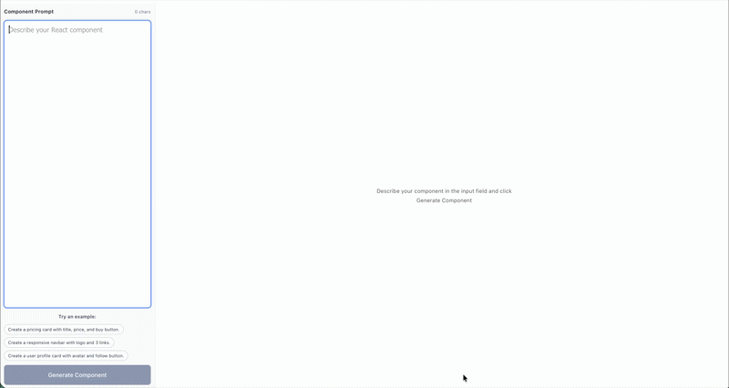

# React Component Generator

A modern web app to instantly generate, preview, and copy-paste React components from natural language prompts. Powered by AI, this tool helps you quickly turn your ideas into reusable React code.

---

## Features
- **Prompt-based Generation:** Describe your component and get ready-to-use React code.
- **Live Preview:** Instantly see the generated component rendered in the browser.
- **Copy to Clipboard:** One-click copy for generated code with visual feedback.
- **Responsive UI:** Works seamlessly on desktop and mobile devices.
- **Customizable:** Easily extend or style components as needed.

---

## Demo




---

## Getting Started


### Installation
```bash
npm install
# or
yarn install
```

### Running the App
```bash
npm run dev
# or
yarn dev
```

Open [http://localhost:5173](http://localhost:5173) in your browser.

---

## Project Structure
```
componentProject/
├── public/
├── src/
│   ├── assets/
│   │   └── appPreview.mov
│   ├── components/
│   ├── helper/
│   ├── services/
│   ├── styles/
│   ├── App.jsx
│   └── ...
├── index.html
├── package.json
└── README.md
```


---

## License
MIT

